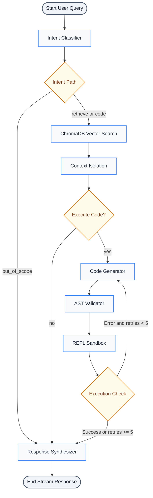

# LangGraph State and Control Flow Orchestration

This document defines the execution flow and state transitions managed by LangGraph within the Multi-Agent Financial Analysis System.

---

## 1. Flowchart Diagram

This diagram separates individual processing tasks (such as validation, compilation, and execution) into distinct single-purpose nodes for improved readability.

---

## 2. Orchestration Logic Details

*   **State Store (`AgentState`)**: A typed dictionary passed between all nodes. It maintains query history (`messages`), current source filtering parameters (`source_filter`), error retry count (`error_count`), and temporary code generation data.
*   **Routing (`route_intent`)**: Evaluates the `intent` field updated by the router node to decide whether to bypass code execution.
*   **Self-Correction Loop (`check_retry`)**: Inspects the sandbox execution output (`execution_result`). If a traceback or exception is present, it returns control to the code generation node and increments `error_count` up to 5 times.
