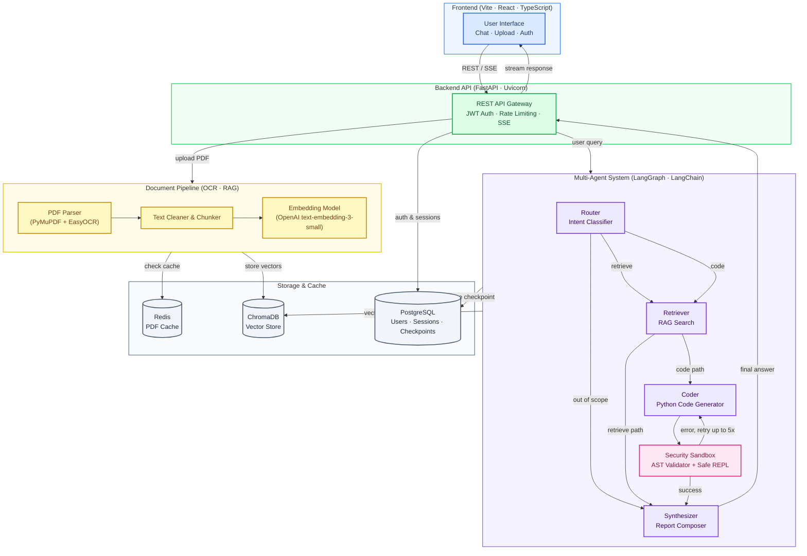
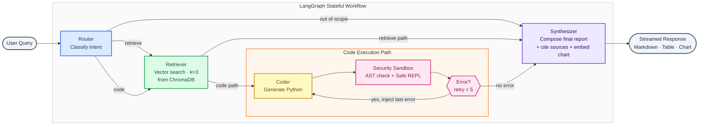

# System Architecture Diagrams — Multi-Agent Financial Analysis System

---

## Diagram 1 — System Overview

```mermaid
graph TD
    subgraph FE ["Frontend  (Vite · React · TypeScript)"]
        UI["User Interface\nChat · Upload · Auth"]
    end

    subgraph BE ["Backend API  (FastAPI · Uvicorn)"]
        API["REST API Gateway\nJWT Auth · Rate Limiting · SSE"]
    end

    subgraph PIPE ["Document Pipeline  (OCR · RAG)"]
        PARSER["PDF Parser\n(PyMuPDF + EasyOCR)"]
        CHUNKER["Text Cleaner & Chunker"]
        EMBEDDER["Embedding Model\n(OpenAI text-embedding-3-small)"]

        PARSER --> CHUNKER --> EMBEDDER
    end

    subgraph AGENT ["Multi-Agent System  (LangGraph · LangChain)"]
        ROUTER["Router\nIntent Classifier"]
        RETRIEVER["Retriever\nRAG Search"]
        CODER["Coder\nPython Code Generator"]
        SANDBOX["Security Sandbox\nAST Validator + Safe REPL"]
        SYNTH["Synthesizer\nReport Composer"]

        ROUTER -->|retrieve| RETRIEVER
        ROUTER -->|code| RETRIEVER
        ROUTER -->|out of scope| SYNTH
        RETRIEVER -->|retrieve path| SYNTH
        RETRIEVER -->|code path| CODER
        CODER --> SANDBOX
        SANDBOX -->|success| SYNTH
        SANDBOX -->|error, retry up to 5x| CODER
    end

    subgraph STORE ["Storage & Cache"]
        REDIS[("Redis\nPDF Cache")]
        CHROMA[("ChromaDB\nVector Store")]
        PG[("PostgreSQL\nUsers · Sessions · Checkpoints")]
    end

    UI -->|REST / SSE| API
    API -->|upload PDF| PIPE
    API -->|user query| AGENT
    PIPE -->|check cache| REDIS
    PIPE -->|store vectors| CHROMA
    AGENT -->|vector search| CHROMA
    AGENT -->|save checkpoint| PG
    API -->|auth & sessions| PG
    SYNTH -->|final answer| API
    API -->|stream response| UI

    classDef fe      fill:#dbeafe,stroke:#2563eb,stroke-width:2px,color:#1e3a5f
    classDef api     fill:#dcfce7,stroke:#16a34a,stroke-width:2px,color:#14532d
    classDef pipe    fill:#fef9c3,stroke:#ca8a04,stroke-width:2px,color:#713f12
    classDef agent   fill:#ede9fe,stroke:#7c3aed,stroke-width:2px,color:#3b0764
    classDef sandbox fill:#fce7f3,stroke:#db2777,stroke-width:2px,color:#831843
    classDef store   fill:#f1f5f9,stroke:#475569,stroke-width:2px,color:#1e293b

    class UI fe
    class API api
    class PARSER,CHUNKER,EMBEDDER pipe
    class ROUTER,RETRIEVER,CODER,SYNTH agent
    class SANDBOX sandbox
    class REDIS,CHROMA,PG store

    style FE    fill:#eff6ff,stroke:#3b82f6,stroke-width:1.5px
    style BE    fill:#f0fdf4,stroke:#22c55e,stroke-width:1.5px
    style PIPE  fill:#fefce8,stroke:#eab308,stroke-width:1.5px
    style AGENT fill:#f5f3ff,stroke:#8b5cf6,stroke-width:1.5px
    style STORE fill:#f8fafc,stroke:#64748b,stroke-width:1.5px
```

---

## Diagram 2 — LangGraph Agent Pipeline

```mermaid
flowchart LR
    START([User Query]) --> ROUTER

    subgraph GRAPH ["LangGraph Stateful Workflow"]
        direction LR

        ROUTER["Router\nClassify intent"]

        RETRIEVER["Retriever\nVector search · k=3\nfrom ChromaDB"]

        subgraph CODE_PATH ["Code Execution Path"]
            direction TB
            CODER["Coder\nGenerate Python"]
            SANDBOX["Security Sandbox\nAST check + Safe REPL"]
            RETRY{{"Error?\nretry < 5"}}

            CODER --> SANDBOX --> RETRY
            RETRY -->|yes, inject last error| CODER
        end

        SYNTH["Synthesizer\nCompose final report\n+ cite sources + embed chart"]

        ROUTER -->|retrieve| RETRIEVER
        ROUTER -->|code| RETRIEVER
        ROUTER -->|out of scope| SYNTH
        RETRIEVER -->|retrieve path| SYNTH
        RETRIEVER -->|code path| CODER
        RETRY -->|no error| SYNTH
    end

    SYNTH --> END([Streamed Response\nMarkdown · Table · Chart])

    classDef router   fill:#dbeafe,stroke:#2563eb,stroke-width:2px,color:#1e3a5f
    classDef rag      fill:#dcfce7,stroke:#16a34a,stroke-width:2px,color:#14532d
    classDef coder    fill:#fef9c3,stroke:#ca8a04,stroke-width:2px,color:#713f12
    classDef sandbox  fill:#fce7f3,stroke:#db2777,stroke-width:2px,color:#831843
    classDef synth    fill:#ede9fe,stroke:#7c3aed,stroke-width:2px,color:#3b0764
    classDef endpoint fill:#f1f5f9,stroke:#475569,stroke-width:2px,color:#1e293b

    class ROUTER router
    class RETRIEVER rag
    class CODER coder
    class SANDBOX sandbox
    class RETRY sandbox
    class SYNTH synth
    class START,END endpoint

    style GRAPH     fill:#fafafa,stroke:#cbd5e1,stroke-width:1.5px
    style CODE_PATH fill:#fff7ed,stroke:#f97316,stroke-width:1.5px
```
