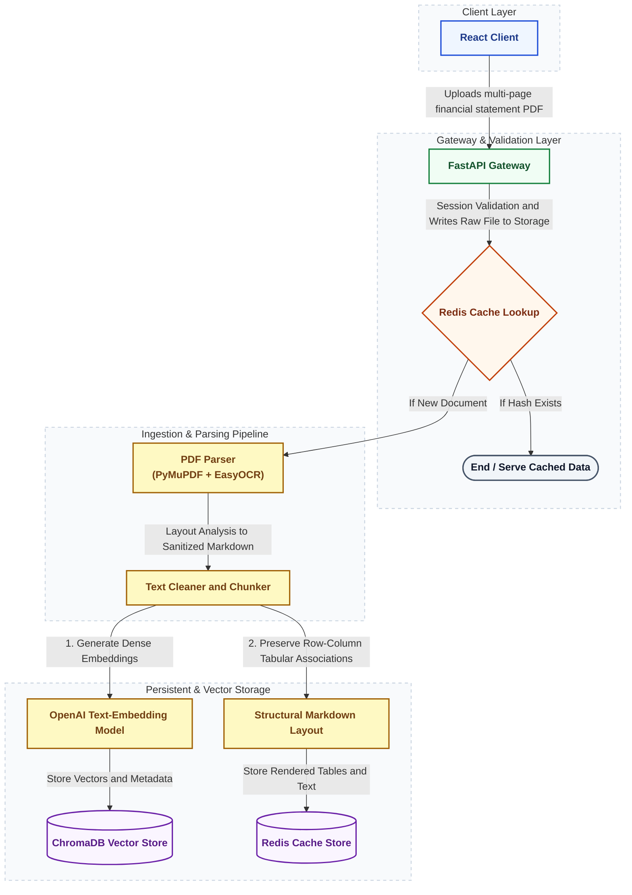

# System Flowcharts: Ingestion and Query Execution Pipelines

This document provides visual flowcharts mapping out the two primary lifecycles within the Multi-Agent Financial Analysis System:
1. **The Ingestion Pipeline Flow** (Unidirectional ingestion and processing pipeline)
2. **The Query-Driven Execution Flow** (Stateful, self-healing multi-agent execution loop)

---

## 1. The Ingestion Pipeline Flow

The Ingestion Pipeline operates as a unidirectional (one-way) flow, managing the ingestion of multi-page financial PDF files, parsing their structure, computing semantic embeddings, preserving tabular associations, and storing them in Redis and ChromaDB.

### Ingestion Flow Diagram



---

## 2. Query-Driven Execution Flow

The Query-Driven Execution Pipeline is a stateful, cyclic workflow managed by LangGraph. It classifies user intent, retrieves isolated financial contexts, compiles state representations, executes generated analytical code in a secure sandbox, and self-heals by feeding runtime exceptions back to the Code Generator for up to five iterations before composition.

### Query-Driven Flow Diagram

```mermaid
flowchart TD
    %% Custom Styling Definitions
    classDef clientStyle fill:#eff6ff,stroke:#1d4ed8,stroke-width:2px,color:#1e3a8a,font-weight:bold;
    classDef gatewayStyle fill:#f0fdf4,stroke:#15803d,stroke-width:2px,color:#14532d,font-weight:bold;
    classDef agentStyle fill:#ede9fe,stroke:#6d28d9,stroke-width:2px,color:#4c1d95,font-weight:bold;
    classDef dbStyle fill:#faf5ff,stroke:#6b21a8,stroke-width:2px,color:#581c87,font-weight:bold;
    classDef checkStyle fill:#fff7ed,stroke:#c2410c,stroke-width:2px,color:#7c2d12,font-weight:bold;
    classDef sandboxStyle fill:#fdf2f8,stroke:#db2777,stroke-width:2px,color:#831843,font-weight:bold;

    subgraph Client ["Client Layer"]
        client["React Interface / User"]:::clientStyle
    end

    subgraph Gateway ["Gateway Layer"]
        gateway["FastAPI Gateway"]:::gatewayStyle
    end

    subgraph Router_Unit ["Routing & Intent Detection"]
        router["Router / Intent Classifier"]:::agentStyle
        pathway{"Pathway Routing"}:::checkStyle
        direct_resp["Direct LLM Response<br/>(Out of Scope / Greeting)"]:::agentStyle
    end

    subgraph Context_Prep ["Retrieval & Context Preparation"]
        retriever["Retriever (RAG Search)"]:::agentStyle
        vector_db[("ChromaDB Vector Store")]:::dbStyle
        isolation["Financial Data Context Isolation<br/>(Extracts Balance Sheets, Footnotes, etc.)"]:::agentStyle
        aggregation["Global State Object Aggregation<br/>(Appends text data to shared state)"]:::agentStyle
    end

    subgraph LangGraph_Loop ["Stateful Self-Healing Coding Loop (LangGraph)"]
        coder["Coder (Qwen2.5-Coder Model)"]:::agentStyle
        sandbox["Security Sandbox (AST Validator)"]:::sandboxStyle
        exec_check{"Execution Check"}:::checkStyle
    end

    subgraph Synthesis ["Report Generation & Delivery"]
        synthesizer["Synthesizer (Gemini 3.0 Flash)"]:::agentStyle
    end

    %% Flow Paths
    client -->|Submit Prompt e.g. Calculate 3-year CAGR of Vinamilk| gateway
    gateway -->|Route Query| router
    router --> pathway
    
    pathway -->|Out-of-scope or Greeting| direct_resp
    direct_resp -->|Direct Response| gateway
    
    pathway -->|Code Pathway - Complex Quantitative| retriever
    retriever -->|Queries Vector Database| vector_db
    retriever --> isolation
    isolation --> aggregation
    
    aggregation -->|Initialize Shared State| coder
    
    %% Self-healing Loop
    coder -->|Generates Python Code using Pandas/Matplotlib| sandbox
    sandbox --> exec_check
    
    exec_check -->|If Exception or Error - Capture Traceback Log and Loop max 5 times| coder
    
    exec_check -->|If Success - Outputs deterministic math results and plot data| synthesizer
    
    synthesizer -->|Compose Report - Prompt and Context and Charts| gateway
    gateway -->|Streams Token-by-Token via SSE| client

    %% Subgraph Box Styling
    style Client fill:#f8fafc,stroke:#cbd5e1,stroke-width:1.5px,stroke-dasharray: 5 5;
    style Gateway fill:#f8fafc,stroke:#cbd5e1,stroke-width:1.5px,stroke-dasharray: 5 5;
    style Router_Unit fill:#f8fafc,stroke:#cbd5e1,stroke-width:1.5px,stroke-dasharray: 5 5;
    style Context_Prep fill:#f8fafc,stroke:#cbd5e1,stroke-width:1.5px,stroke-dasharray: 5 5;
    style LangGraph_Loop fill:#fffbfa,stroke:#f97316,stroke-width:1.5px,stroke-dasharray: 4 4;
    style Synthesis fill:#f8fafc,stroke:#cbd5e1,stroke-width:1.5px,stroke-dasharray: 5 5;
