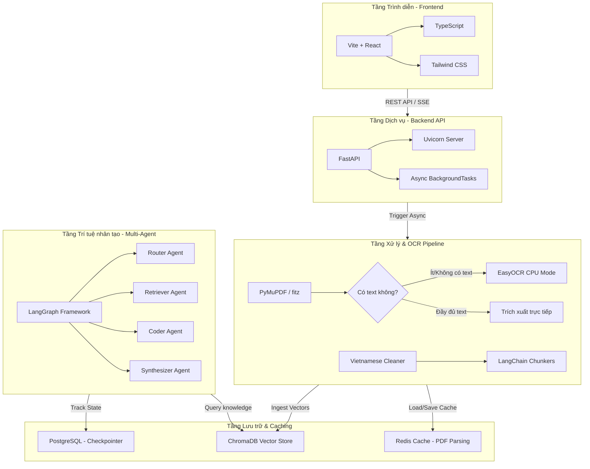

# TÀI LIỆU CÔNG NGHỆ (TECH STACK)
## Hệ thống Multi-Agent Phân tích Báo cáo Tài chính tự động

Tài liệu này mô tả chi tiết toàn bộ các công nghệ đang được sử dụng trong dự án Luận văn **Multi-Agent Financial Analysis System**, chỉ rõ vị trí áp dụng và vai trò của từng công nghệ trong kiến trúc tổng thể.

---

## 1. TỔNG QUAN KIẾN TRÚC HỆ THỐNG
Hệ thống được thiết kế theo mô hình phân lớp hiện đại giúp tối ưu hóa hiệu năng, tách biệt giao diện, logic nghiệp vụ, công cụ xử lý dữ liệu nặng và luồng suy luận của AI Agents:

---

## 2. CHI TIẾT CÁC CÔNG NGHỆ SỬ DỤNG & VỊ TRÍ ÁP DỤNG

### 2.1. Tầng Giao diện Người dùng (Frontend)
Tập trung vào trải nghiệm mượt mà, phản hồi nhanh và giao diện phân tích tài chính trực quan.

| Công nghệ | Vai trò trong hệ thống | Vị trí áp dụng trong Code |
| :--- | :--- | :--- |
| **Vite** | Build tool cực nhanh, hỗ trợ Hot Module Replacement (HMR) giúp tối ưu thời gian phát triển giao diện. | `frontend/vite.config.ts`, `frontend/package.json` |
| **React** | Xây dựng các component UI động, quản lý trạng thái luồng hội thoại với Chatbot và danh sách tài liệu. | `frontend/src/` |
| **TypeScript** | Định nghĩa kiểu dữ liệu chặt chẽ cho cấu trúc báo cáo tài chính, tin nhắn chat và thông tin file. | `frontend/tsconfig.json`, `frontend/src/**/*.ts*` |
| **Tailwind CSS** | Thiết kế giao diện hiện đại, responsive, hỗ trợ các biểu đồ tài chính và màn hình chat chuyên nghiệp. | `frontend/tailwind.config.js`, `frontend/postcss.config.js` |

---

### 2.2. Tầng Cung cấp dịch vụ (Backend API)
Xử lý các API endpoint, nạp file, deduplication và quản lý hàng đợi tác vụ chạy ngầm để tránh nghẽn luồng.

| Công nghệ | Vai trò trong hệ thống | Vị trí áp dụng trong Code |
| :--- | :--- | :--- |
| **FastAPI** | Cung cấp hệ thống RESTful API tốc độ cực cao, tự động sinh tài liệu Swagger UI OpenAPI. | `backend/api/server.py`, `backend/main.py` |
| **Uvicorn** | ASGI server hiệu năng cao dùng để chạy ứng dụng FastAPI. | `backend/api/server.py` |
| **Asyncio** | Thực hiện các tác vụ phi tập trung (Async/Await) và đẩy các tác vụ nặng (như OCR) vào thread chạy độc lập (`asyncio.to_thread`) để tránh block Event Loop. | `backend/api/document.py` |
| **Pydantic** | Xác thực dữ liệu đầu vào/đầu ra của các request API (Schemas) báo cáo tài chính. | `backend/api/schemas.py` |

---

### 2.3. Tầng Xử lý Dữ liệu & OCR Pipeline (Tối ưu cho Máy yếu)
Đây là tầng nhận tài liệu BCTC, tự động phát hiện bản Scan hay Digital và áp dụng cơ chế Fallback OCR tối ưu nhất.

| Công nghệ | Vai trò trong hệ thống | Vị trí áp dụng trong Code |
| :--- | :--- | :--- |
| **PyMuPDF (fitz)** | Thư viện phân tích PDF nhanh nhất hiện nay. Được dùng để trích xuất text trực tiếp (đối với Digital PDF) và chuyển đổi các trang PDF sang dạng ma trận điểm ảnh (Pixmap) cho OCR. | [pdf_parser.py](file:///e:/Thesis/backend/data_processing/pdf_parser.py) |
| **EasyOCR** | Bộ máy OCR mã nguồn mở, hoạt động ổn định trên CPU máy yếu (không lo lỗi Driver/CUDA), hỗ trợ nhận diện Tiếng Việt rất chuẩn xác cho các bảng số liệu tài chính. | [pdf_parser.py](file:///e:/Thesis/backend/data_processing/pdf_parser.py#L20-L26) |
| **NumPy** | Đọc dữ liệu thô từ PyMuPDF Pixmap và chuyển đổi định dạng ảnh phù hợp cho EasyOCR xử lý. | [pdf_parser.py](file:///e:/Thesis/backend/data_processing/pdf_parser.py#L55-L57) |
| **Text cleaner & Chunker** | Chuẩn hóa tiếng Việt, làm sạch các khoảng trắng dư thừa, và bóc tách cấu trúc tài liệu PDF thành các chunk nhỏ dựa trên tiêu đề Markdown (`## Trang`) để chuẩn bị lưu trữ Vector. | `backend/data_processing/cleaner.py`, `backend/data_processing/chunker.py` |

---

### 2.4. Tầng Trí tuệ Nhân tạo & Multi-Agent
Hệ thống tác tử thông minh thực hiện chu trình phân tích báo cáo tài chính chuyên sâu.

| Công nghệ | Vai trò trong hệ thống | Vị trí áp dụng trong Code |
| :--- | :--- | :--- |
| **LangGraph** | Framework cốt lõi để xây dựng cấu trúc **Multi-Agent** thông qua đồ thị trạng thái tuần hoàn (Stateful Graph). Quản lý chu trình suy luận của Agents. | `backend/agents/graph.py`, `backend/agents/state.py` |
| **LangChain Core** | Cung cấp giao diện trừu tượng cho LLM (OpenAI, Gemini), Embedding Model, Document Chunker và kết nối Vector Store. | `backend/pyproject.toml`, `backend/agents/` |
| **OpenAI API & Google GenAI** | Cung cấp các LLM cao cấp (GPT-4o, Gemini 1.5 Pro/Flash) làm não bộ suy luận cho các Agents để phân tích dữ liệu số học và trích xuất chỉ số. | `backend/agents/coder.py`, `backend/agents/synthesizer.py` |

#### Kiến trúc cụ thể của các Agents trong hệ thống (`backend/agents/`):
1.  **Router Agent (`router.py`)**: Nhận câu hỏi tài chính từ người dùng và phân tích để chuyển tiếp đến Agent phù hợp nhất.
2.  **Retriever Agent (`retriever.py`)**: Thực hiện tìm kiếm ngữ nghĩa (Semantic Search) trên ChromaDB để lấy các số liệu cụ thể của Báo cáo tài chính liên quan.
3.  **Coder Agent (`coder.py`)**: Tự động viết và thực thi mã Python để tính toán các tỷ số tài chính phức tạp (ROA, ROE, nợ/vốn chủ sở hữu) từ bảng số liệu thô.
4.  **Synthesizer Agent (`synthesizer.py`)**: Tổng hợp dữ liệu số học từ Coder Agent và dữ liệu ngữ cảnh từ Retriever Agent để tạo ra báo cáo phân tích tài chính cuối cùng gửi người dùng.

---

### 2.5. Tầng Cơ sở dữ liệu, Caching & Lưu trữ Tri thức
Đảm bảo an toàn dữ liệu, tính bền vững và tốc độ truy vấn cho hệ thống.

| Công nghệ | Vai trò trong hệ thống | Vị trí áp dụng trong Code |
| :--- | :--- | :--- |
| **ChromaDB** | Cơ sở dữ liệu Vector (Vector Database) lưu trữ tri thức báo cáo tài chính (RAG). Cho phép tìm kiếm tương đồng ngữ nghĩa cực nhanh dựa trên embeddings. | `backend/api/document.py`, `backend/agents/retriever.py` |
| **Redis** | Cơ chế **PDF Cache**. Kết quả parse PDF và chạy OCR nặng (mất vài phút/file) được lưu trữ vào Redis. Khi người dùng truy vấn hoặc nạp lại file, kết quả được lấy ngay lập tức từ Cache (Cache Hit) chỉ mất **0.01 giây**, giảm tải hoàn toàn cho CPU. | [cache.py](file:///e:/Thesis/backend/utils/cache.py), [pdf_parser.py](file:///e:/Thesis/backend/data_processing/pdf_parser.py#L35-L39) |
| **PostgreSQL** | Cơ sở dữ liệu quan hệ dùng để lưu trữ trạng thái lịch sử hội thoại (Chat History) và ghi lại Checkpoint tiến trình của LangGraph. | `backend/pyproject.toml` |

---

## 3. TÍNH NĂNG TÍCH HỢP NỔI BẬT

### 🚀 Tích hợp luồng nạp PDF & OCR thông minh:
*   Khi người dùng upload tệp PDF từ **Frontend UI**:
    1.  Tệp được gửi qua API endpoint `/api/v1/upload-pdf` của **FastAPI**.
    2.  Hệ thống chạy tác vụ ngầm bất đồng bộ thông qua **BackgroundTasks**.
    3.  **FastPDFParser** kiểm tra xem tệp đã được xử lý trong **Redis Cache** chưa. Nếu có, nó lấy ngay kết quả.
    4.  Nếu không có trong cache, nó phân tích bằng **PyMuPDF**. Nếu phát hiện trang tài liệu scan (không có chữ dạng số hóa), nó tự động kích hoạt bộ máy **EasyOCR (CPU Mode)** chỉ trên trang đó (Lazy Loading).
    5.  Sau khi lấy text, hệ thống tự động làm sạch tiếng Việt, cắt thành các chunk nhỏ, tạo embedding và lưu vào **ChromaDB**.
    6.  Trạng thái xử lý (`processing` -> `completed` / `indexed`) được đồng bộ hóa liên tục để người dùng theo dõi tiến trình trực quan trên giao diện Frontend.
